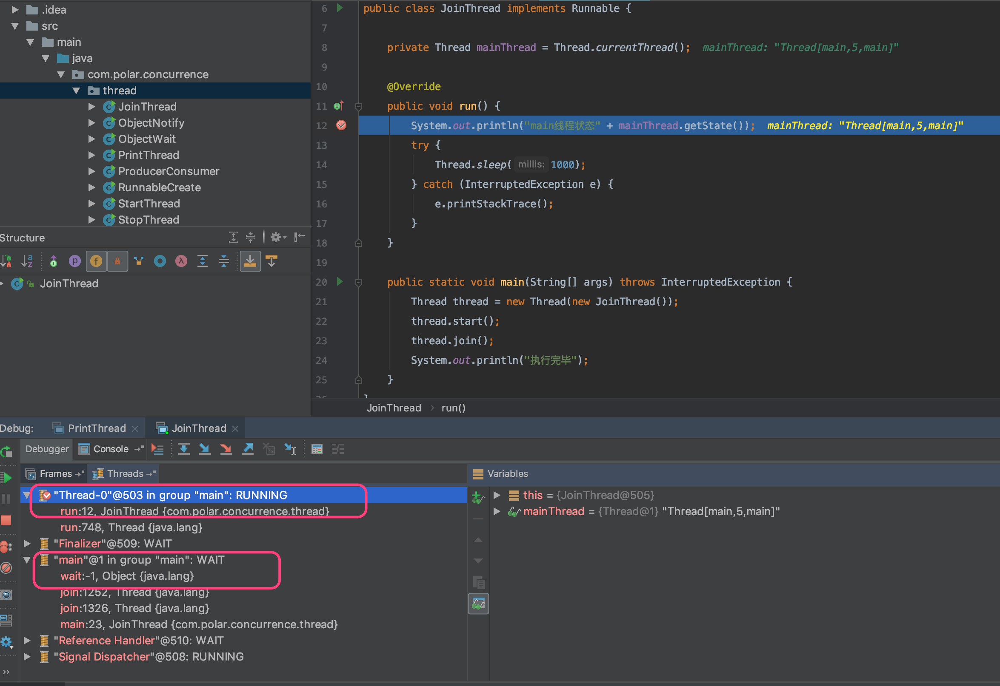

## 1.Object中的方法

- wait(): 阻塞方法, 调用之前必须获取监视器锁,wait方法调用后会释放监视器锁
- notify():唤醒一个线程,调用notify时必须获取到监视器锁,否则会抛出异常
- notifyAll():唤醒所有的线程,但是是否获得锁得看操作系统的调度

```java
public class ObjectWait {

    private static final Object objectLock = new Object();

    public static void main(String[] args) throws InterruptedException {
        Thread thread1 = new Thread(() -> {
           synchronized (objectLock) {
               System.out.println(Thread.currentThread().getName() + "开始获取到锁");
               try {
                   // wait 时会释放锁,同时会阻塞, 必须在synchronized中使用
                   objectLock.wait();
               } catch (InterruptedException e) {
                   e.printStackTrace();
               }
               System.out.println(Thread.currentThread().getName() + "执行完毕");
           }
        });

        Thread thread2 = new Thread(() -> {
           synchronized (objectLock) {
               System.out.println(Thread.currentThread().getName() + "开始获取到锁");
               objectLock.notify();
               System.out.println(Thread.currentThread().getName() + "执行完毕");
           }
        });

        thread1.start();
        Thread.sleep(200);
        thread2.start();
    }
}

//运行结果
Thread-0开始获取到锁
Thread-1开始获取到锁
Thread-1执行完毕
Thread-0执行完毕
```

### 1-1.调用notify方法时只会唤醒一个线程

```java
public class ObjectNotify implements Runnable {

    private static final Object objectLock = new Object();

    @Override
    public void run() {
        synchronized (objectLock) {
            System.out.println(Thread.currentThread().getName() + "获取到锁");
            try {
                objectLock.wait();
            } catch (InterruptedException e) {
                e.printStackTrace();
            }
            System.out.println(Thread.currentThread().getName() + "执行结束");
        }
    }

    public static void main(String[] args) throws InterruptedException {
        new Thread(new ObjectNotify()).start();
        new Thread(new ObjectNotify()).start();

        Thread.sleep(200);

        synchronized (objectLock) {
            objectLock.notify();
        }
    }
}

// 执行结果
Thread-0获取到锁
Thread-1获取到锁
Thread-0执行结束


// 调用notifyAll唤醒所有线程
    public static void main(String[] args) throws InterruptedException {
        new Thread(new ObjectNotify()).start();
        new Thread(new ObjectNotify()).start();

        Thread.sleep(200);

        synchronized (objectLock) {
            objectLock.notify();
        }
    }
    
// 执行结果
Thread-0获取到锁
Thread-1获取到锁
Thread-1执行结束
Thread-0执行结束
```

### 1-2.wait, notify实现生产者消费者模式

- 阻塞队列

```java
    // 阻塞队列
    static class EventCollection  {
        private int maxSize;
        private LinkedList<Date> blockList;

        public EventCollection() {
            this.maxSize = 10;
            this.blockList = new LinkedList<>();
        }

       
        public synchronized void put(Date param)  {
            // 阻塞队列满了
            while (this.maxSize == blockList.size()) {
                try {
                    wait();
                } catch (InterruptedException e) {
                    e.printStackTrace();
                }
            }

            blockList.add(param);
            System.out.println("阻塞队列中有" + blockList.size() + "个元素");
            notify();
        }

        public synchronized void take() {
            // 阻塞队列为空
            while (blockList.size() == 0) {
                try {
                    wait();
                } catch (InterruptedException e) {
                    e.printStackTrace();
                }
            }

            Date param = blockList.poll();
            System.out.println("弹出元素[" + param + "]现在还剩下" + blockList.size() + "个元素");
            notify();
        }
    }
```

- 生产者

```java
    static class Producer implements Runnable {
        private EventCollection collection;

        public Producer(EventCollection collection) {
            this.collection = collection;
        }

        @Override
        public void run() {
            while (true) {
                collection.put(new Date());
            }
        }
    }
```

- 消费者

```java
    static class Consumer implements Runnable {
        private EventCollection collection;

        public Consumer(EventCollection collection) {
            this.collection = collection;
        }

        @Override
        public void run() {
            while (true) {
                collection.take();
            }
        }
    }
```

- main方法测试

```java
    public static void main(String[] args) {
        EventCollection eventCollection = new EventCollection();
        Producer producer = new Producer(eventCollection);
        Consumer consumer = new Consumer(eventCollection);
        new Thread(producer).start();
        new Thread(consumer).start();
    }
```

### 1-3.两个线程交替打印奇数和偶数

```java
public class PrintThread implements Runnable {
    private static Integer num = 1;
    private static final Object objLock = new Object();


    public static void main(String[] args) throws InterruptedException {
        new Thread(new PrintThread()).start();
        Thread.sleep(100);
        new Thread(new PrintThread()).start();
    }

    @Override
    public void run() {
        synchronized (objLock) {
            while (num <= 100) {
                System.out.println(Thread.currentThread().getName() + "打印" + num);
                num++;
                objLock.notify();

                if (num < 100) {
                    try {
                        objLock.wait();
                    } catch (InterruptedException e) {
                        e.printStackTrace();
                    }
                }
            }
        }
    }
}
```

## 2.Thread中的方法

### 2-1.Sleep方法

- Sleep方法可以让线程进入waiting状态
- sleep期间不占用cpu的资源
- sleep方法不释放锁
- 休眠期间如果被中断,则抛出异常

### 2-2.wait和sleep的异同

- 相同点:

> 1.都可以使得线程阻塞
>
> 2.都可以响应中断
>
> 3.都可以使得线程进入waiting或者TimedWaiting状态

- 不同

> 1.sleep属于Thread类, wait属于Object类
>
> 2.sleep不会释放锁,wait会释放锁

### 2-3.join方法

新的线程加入了当前运行线程, 所以要等加入的线程执行完毕主线程再执行, 当主线程等待子线程的时候, 主线程的状态是waiting

