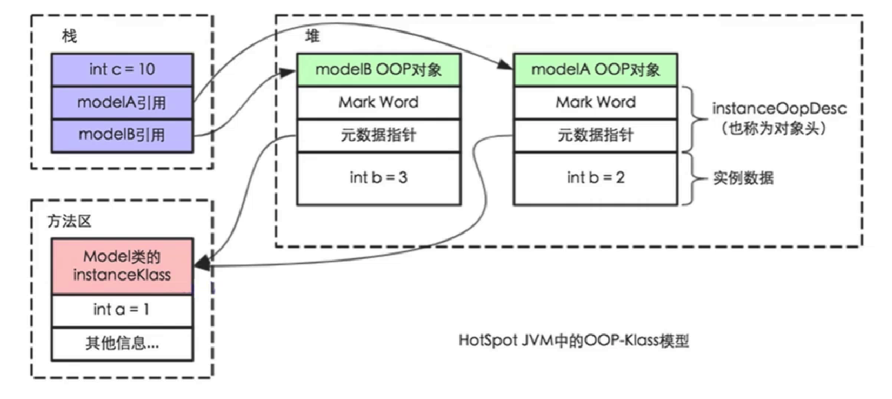
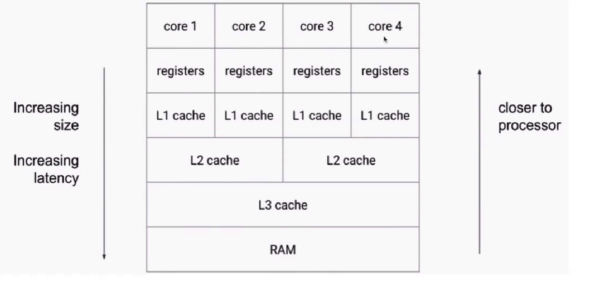
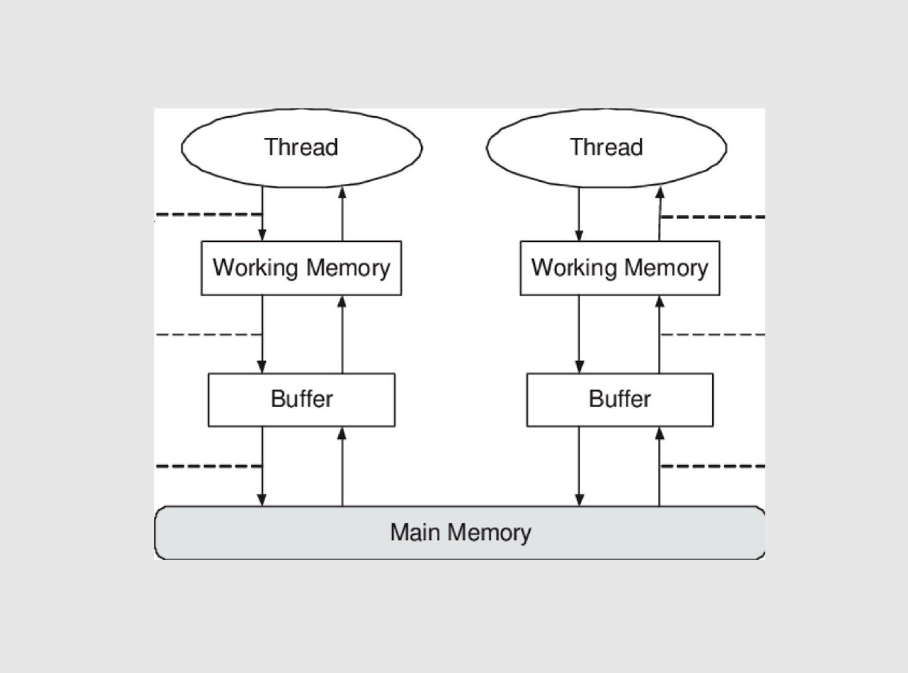
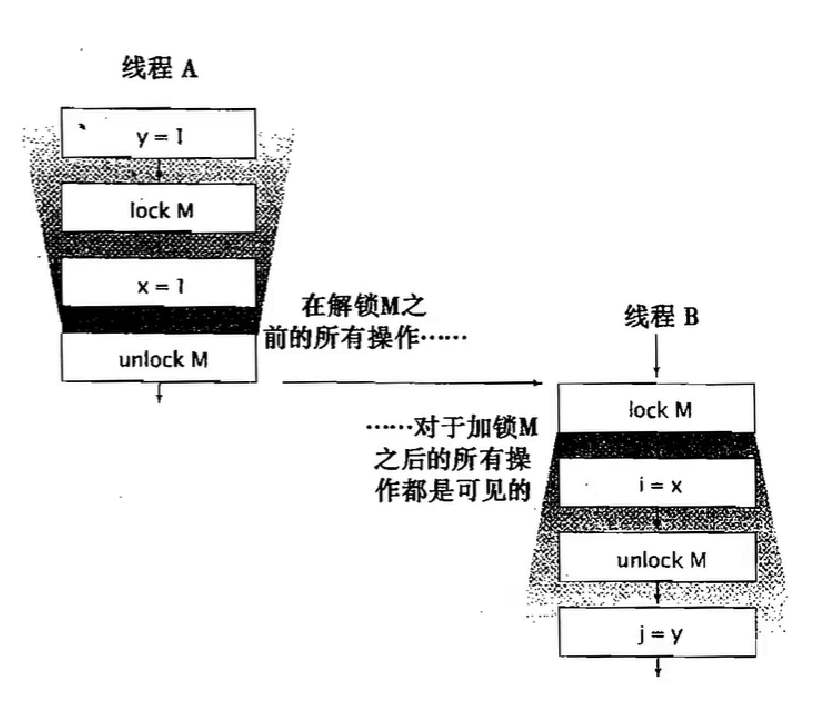

## 1.并发基础

### 1-1.JVM内存结构

和java虚拟机运行的各个区域有关

- 方法区(Method Area): 线程共享区域, 存储一些静态不变的常量 && 加载的字节码信息 && 永久引用
- 堆(Heap): 线程共享区域, Java中的实例对象主要存储区域, 也是垃圾回收器的主要回收空间
- Java栈(Java Stack): 线程私有区域, 保存了基本数据类型以及对于对象的引用, 编译期间就确定了大小, 运行时大小不会改变
- 本地方法(Native Method Stack): 保存JVM Native信息
- 程序计数器:很小的一块空间, 保存线程执行字节码的行号数,下一条执行的指令等信息, 用户CPU切换后的线程恢复执行

### 1-2.Java对象模型

和java对象在虚拟机中的表现形式有关系

- JVM会创建一个类的InstanceClass保存在方法区中
- 当我们new创建对象时, 会根据InstanceClass创建一个InstanceOopDesc对象,这个对象包含了对象头和实例数据

### 1-3.Java内存模型

和java的并发编程有关, 也成JMM(JAVA Memery Model)

#### 1-3-1.为什么需要JMM

- JMM实际上是一组规范, 开发者可以利用这些规范,更方便的开发多线程的程序
- 如果没有JMM内存模型规范, 那么可能在不同虚拟机上运行的结果不一致
- JMM是工具类和关键字的原理
- JMM的3大特性: 重排序, 可见性, 原子性

#### 1-3-2.可见性问题

程序运行cup与内存关系图

- CPU有多层缓存, 导致读的数据过期
- 高速缓存的容量比较小,但是速度快, 所以在主存和CPU之间有多级缓存
- 每一个CPU核心都会将自己需要的数据读取到独占缓存中,数据修改后也是写入到缓存中,然后等待时机刷入到主存. 在这个期间有的CPU读取到的数据就是一个过期值

#### 1-3-3.主内存和本地内存

Java作为一门高级语言, 屏蔽了CPU硬件的各级缓存细节,JMM定义了一套读写内存规范,提出了主内存和本地内存的概念

- 所有的变量都存储在主内存中, 同时每一个线程都有自己的工作内存, 工作内存中的变量是主内存中变量内容的拷贝
- 线程不能直接读取主内存中的变量, 只能通过操作自己工作内存中的变量,然后同步到主内存
- 主内存是多个线程共享空间,但是工作内存不共享,是线程独占, 如果线程需要通信, 必须借助主内存

> 正式因为这个工作内存和主内存之间变量的交换,才产生了可见性问题

#### 1-3-4.Happens-Before规则

如何理解 Happens-Before 呢？如果望文生义（很多网文也都爱按字面意思翻译成“先行发生”），那就南辕北辙了，Happens-Before 并不是说前面一个操作发生在后续操作的前面，它真正要表达的是：前面一个操作的结果对后续操作是可见的

- 1.单线程: 在单线程中,后执行的语句能看到在它之前执行语句的结果

- 2.锁操作(synchronize, Lock): 在解锁之前的所有操作, 都能被之后的加锁看到

  >

- 3.volatile:当对一个volatile修饰的变量写后, 后面的读操作能看见之前的写入

- 4.线程启动: 子线程执行过程中能看到主线程启动该子线程之前的执行结果

- 5.线程join:join之后的语句能看到刚才join等待线程执行的结果

- 6.传递性: 这条规则是指如果 A Happens-Before B，且 B Happens-Before C，那么 A Happens-Before C。

- 7.中断:如果一个线程被interrupt, 那么检测中断isInterrupt || InterruptException一定能被检测到

- 8.工具类的Happens-Before: 

- > - 线程安全容器的get, 一定能看到在此之前的put等操作
  > - CountDownlatch, Samaphore提供内存栅栏
  > - Future的get方法一定能看到线程执行的结果
  > - 线程池提交任务时,能看到提交之前主线程的执行结果