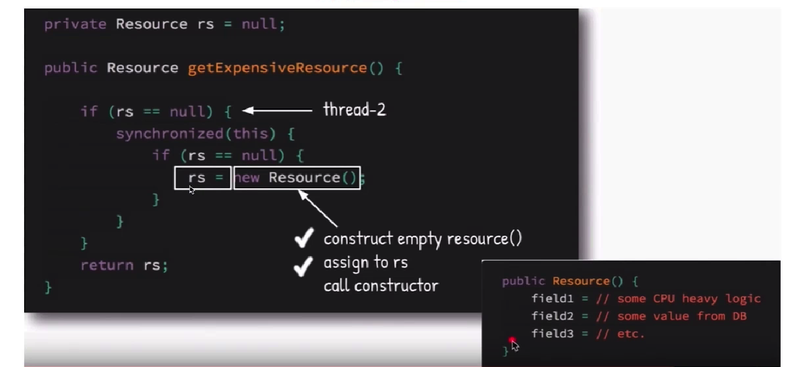

## 1.认识原子性

一系列的操作要么都成功, 要么都不成功,不会出现执行一半的情况

### 1-1.long和double的原子性

- long 和double都是64位, 在32位机器上每次只能写入高32位或者低32位

- 在32位的JVM上long 和double的操作不是原子性的, 但是在64位的JVM上是原子性的; 一般在商用JVM中已经保证了long && double的原子性

## 2.JMM应用—单利模式

- 饿汉式: 在类装载的时候就加载对象

```java
public class Singleton1 {

    private static final Singleton1 INSTANCE = new Singleton1();

    private Singleton1() {
    }

    public Singleton1 getInstance() {
        return INSTANCE;
    }
}
```

- 线程不安全的懒汉式(不可用):

```java
public class Singleton2 {

    private static Singleton2 instance;

    private Singleton2() {}

    public static Singleton2 getInstance() {
        if (null == instance) { // 多线程并发判断, 创建多个instance实例
            instance = new Singleton2();
        }
        return instance;
    }
}
```

- 线程安全的懒汉式(不推荐):

```java
public class Singleton2 {

    private static Singleton2 instance;

    private Singleton2() {}

    // 添加synchronized锁机制保护, 效率低
    public synchronized static Singleton2 getInstance() {
        if (null == instance) {
            instance = new Singleton2();
        }
        return instance;
    }
}
```

- 双重检查(推荐使用):

```java
public class Singleton3 {

    private static volatile Singleton3 instance;

    private Singleton3() {
    }

    public static Singleton3 getInstance() {
        if (null == instance) {
            synchronized (Singleton3.class) {
                if (null == instance) {
                    instance = new Singleton3();
                }
            }
        }

        return instance;
    }
}
```

如果不加volatile,会产生线程安全问题分析

> - 使用volatile的原因: 因为创建对象不是原子性的: 1.创建一个新的对象 2. 调用构造方法初始化 3.将对象赋值给引用, 如果不使用volatile可能在创建对象时发生重排序
>
> - 使用volatile保证了可见性, 给单利赋值以后能保证其他线程rs==null 判断时能立马看到



- 静态内部类, 可用(懒汉):

> 1. JVM规定外部类加载的时候不会直接加载内部类, 所以就成了懒汉式
> 2. 并发问题由JVM保证

```java
public class Singleton4 {

    private Singleton4() {
    }

    private static class SingletonInstance {
        private static final Singleton4 INSTANCE = new Singleton4();
    }

    public static Singleton4 getInstance() {
        return SingletonInstance.INSTANCE;
    }
}
```

- 枚举方式(生产推荐):

```java
public enum Singleton5 {
    INSTANCE;

    public void dosomthing() {

    }
}

// 调用方
public static void main(String[] args) {
  Singleton5.INSTANCE.dosomthing();
}
```

### 2-2.各种单利对比

- 饿汉式: 简单, 但是没有lazy-loading
- 懒汉模式: 默认的有线程安全问题
- 静态内部类: 可以使用, 还可以
- 双重检查: 涉及知识点多, 面试技巧
- 枚举方式: 简单, 产线代码使用

在effective Java中, 作者指出使用枚举实现单利是最好的: 1.简单 2.线程安全 3.懒加载 4.避免反序列化破坏单利

