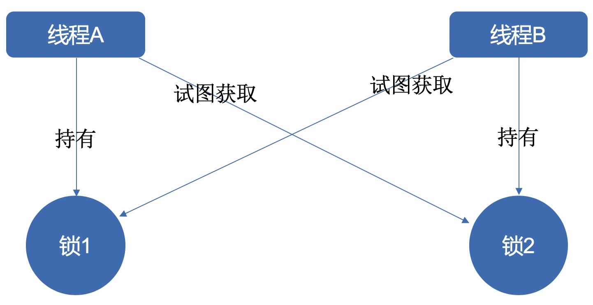
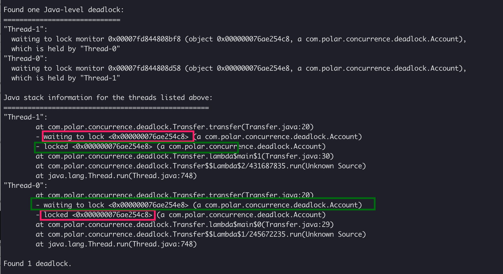

## 1.死锁

- 发生在并发中:
- 互不想让: 两个或者更多的线程持有对方的资源, 又不主动释放导致所有人都无法前进, 使其陷入阻塞



### 1-1.死锁的影响

- 不一定发生,但是遵守"墨菲定律"
- 一旦发生,多是高并发场景,影响用户大
- 压力测试无法找出潜在所有死锁

### 1-2.模拟死锁的发生

```java
public class Deadlock1 implements Runnable {

    private Boolean flag;

    private static final Object objLock1 = new Object();
    private static final Object objLock2 = new Object();

    public Deadlock1(Boolean flag) {
        this.flag = flag;
    }

    @Override
    public void run() {
        if (flag) {
            synchronized (objLock1) {
                try {
                    Thread.sleep(1000);
                } catch (InterruptedException e) {
                    e.printStackTrace();
                }

                synchronized (objLock2) {
                    System.out.println("objLock2 获取到了资源");
                }
            }
            return;
        }

        synchronized (objLock2) {
            try {
                Thread.sleep(1000);
            } catch (InterruptedException e) {
                e.printStackTrace();
            }

            synchronized (objLock1) {
                System.out.println("objLock1 获取到了资源");
            }
        }
    }

    public static void main(String[] args) {
        new Thread(new Deadlock1(true)).start();
        new Thread(new Deadlock1(false)).start();
    }
}
```

- 转账发生死锁

Account账户类:

```java
public class Account {

    private Integer total;

    public Account(Integer total) {
        this.total = total;
    }

    public Integer getTotal() {
        return total;
    }

    public void setTotal(Integer total) {
        this.total = total;
    }
}
```


转账死锁模拟类:

```java
public class Transfer {

    private static Account account1 = new Account(500);
    private static Account account2 = new Account(500);

    private static void transfer(Account from, Account to, Integer transfer) {
        synchronized (from) {
            try {
                Thread.sleep(100);
            } catch (InterruptedException e) {
                e.printStackTrace();
            }

            synchronized (to) {
                if (from.getTotal() >= transfer) {
                    from.setTotal(from.getTotal() - transfer);
                    to.setTotal(to.getTotal() + transfer);
                }
            }
        }
    }

    public static void main(String[] args) throws Exception {
        Thread thread1 = new Thread(() -> transfer(account1, account2, 500));
        Thread thread2 = new Thread(() -> transfer(account2, account1, 500));

        thread1.start();
        thread2.start();

        thread1.join();
        thread2.join();

        System.out.println("account1 = " + account1.getTotal());
        System.out.println("account2 = " + account2.getTotal());
    }
}
```


### 1-3.死锁发生的必要条件

- 互斥条件(资源的互斥性):  一个资源同时只能被一个线程使用
- 请求与保持条件: 当线程被阻塞时不会释放已经拥有的锁资源
- 不可剥夺条件: 线程拥有的锁不可被其他线程剥夺
- 循环等待条件: 线程对资源的请求形成一个环路等待 A等待B, B等C, C又等A...

## 2.死锁的定位

### 2-1.jstack

1.使用jps查看java的pid

2.使用jstack分析线程栈, 定位死锁: jstack pid

> - Thread-1: 已经获取到锁254e8
> - Thread-2: 已经获取到锁254c8
> - Thread-1: 等待254c8
> - Thread-2: 等待254e8




### 2-2.代码形式发现死锁

- 发现死锁的类

```java
public class DeadLockDiscovery {

    public static void findDeadLock() {
        ThreadMXBean threadMXBean = ManagementFactory.getThreadMXBean();
        long[] deadlockedThreads = threadMXBean.findDeadlockedThreads();
        if (deadlockedThreads != null && deadlockedThreads.length > 0) {
            for (long threadId : deadlockedThreads) {
                ThreadInfo threadInfo = threadMXBean.getThreadInfo(threadId);
                System.out.println(threadInfo);
            }
        }
    }
}
```

- 调用

```java
public class Transfer {

    private static Account account1 = new Account(500);
    private static Account account2 = new Account(500);

    private static void transfer(Account from, Account to, Integer transfer) {
        synchronized (from) {
            try {
                Thread.sleep(100);
            } catch (InterruptedException e) {
                e.printStackTrace();
            }

            synchronized (to) {
                if (from.getTotal() >= transfer) {
                    from.setTotal(from.getTotal() - transfer);
                    to.setTotal(to.getTotal() + transfer);
                }
            }
        }
    }

    public static void main(String[] args) throws Exception {
        Thread thread1 = new Thread(() -> transfer(account1, account2, 500));
        Thread thread2 = new Thread(() -> transfer(account2, account1, 500));

        thread1.start();
        thread2.start();

        Thread.sleep(100);
        DeadLockDiscovery.findDeadLock();
    }
}

// 运行结果
"Thread-1" Id=14 BLOCKED on com.polar.concurrence.deadlock.Account@7d417077 owned by "Thread-0" Id=13
  
"Thread-0" Id=13 BLOCKED on com.polar.concurrence.deadlock.Account@7dc36524 owned by "Thread-1" Id=14
```

## 3.修复死锁

- 保存案发现场, 方便问题定位
- 重启服务器, 恢复服务
- 分析保存的案发现场分析,修复

### 3-1.常见修复策略

- 避免策略: 哲学家就餐的换手方案, 转账换序号方案

> 1. 按照某种排序规则排序后依次获取锁
> 2. 如果排序后大小一样, 则采用"加时赛", 共同抢占同一把锁, 谁先抢到谁先执行
> 3. 一般数据库中都有主键之类的自增且不会重复策略, 我们可以采用这个作为排序规则

- 检测与恢复策略: 一段时间检测是否有死锁, 如果有就剥夺某一个资源, 来打开死锁
- 鸵鸟策略: 忽略死锁, 如果有发生则人工修复

### 3-1.避免死锁的小tip

- 获取锁时设置超时时间, 比如Lock类中的tryLock

```java
public class TryLock implements Runnable {

    private Boolean flag;

    private static final Lock lock1 = new ReentrantLock();
    private static final Lock lock2 = new ReentrantLock();

    public TryLock(Boolean flag) {
        this.flag = flag;
    }

    @Override
    public void run() {
        if (flag) {
            while (true) {
                try {
                    if (lock1.tryLock(800, TimeUnit.MILLISECONDS)) {
                        Thread.sleep(5);
                        if (lock2.tryLock(800, TimeUnit.MICROSECONDS)) {
                            System.out.println("线程1获取到了A-B两把锁");
                            Thread.sleep(300);
                            lock2.unlock();
                            lock1.unlock();
                            break;
                        } else {
                            System.out.println("线程1释放锁A");
                            lock1.unlock();
                        }
                    } else {
                        System.out.println("线程1没有获取到锁A, 重试");
                    }
                } catch (InterruptedException e) {
                    e.printStackTrace();
                }
            }
        } else {
            while (true) {
                try {
                    if (lock2.tryLock(3000, TimeUnit.MILLISECONDS)) {
                        Thread.sleep(2);
                        if (lock1.tryLock(3000, TimeUnit.MICROSECONDS)) {
                            System.out.println("线程2获取到了A-B两把锁");
                            lock2.unlock();
                            lock1.unlock();
                            break;
                        } else {
                            lock2.unlock();
                            System.out.println("线程2释放锁B");
                        }
                    } else {
                        System.out.println("线程2没有获取到锁B, 重试");
                    }
                } catch (InterruptedException e) {
                    e.printStackTrace();
                }
            }
        }
    }

    public static void main(String[] args) {
        new Thread(new TryLock(true)).start();
        new Thread(new TryLock(false)).start();
    }
}

// 运行结果
线程1释放锁A
线程2释放锁B
线程2释放锁B
线程1获取到了A-B两把锁
线程2获取到了A-B两把锁
```

- 使用并发类, 而不是自己设计

- 降低锁的使用颗粒度
- 专锁专用

## 4.活锁

- 虽然线程没有阻塞, 也始终在运行, 但是得不到进展,始终在进行重复工作
- 比喻: 马路中间有条小桥，只能容纳一辆车经过，桥两头开来两辆车A和B，A比较礼貌，示意B先过，B也比较礼貌，示意A先过，结果两人一直谦让谁也过不去。


## 5.饥饿

当线程需要某些资源, 例如CPU资源, 但是始终得不到, 我们尽量不要设计线程的优先级

> 如果线程T1占用了资源R，线程T2又请求封锁R，于是T2等待。T3也请求资源R，当T1释放了R上的封锁后，系统首先批准了T3的请求，T2仍然等待。然后T4又请求封锁R，当T3释放了R上的封锁之后，系统又批准了T4的请求…，T2可能永远等待。