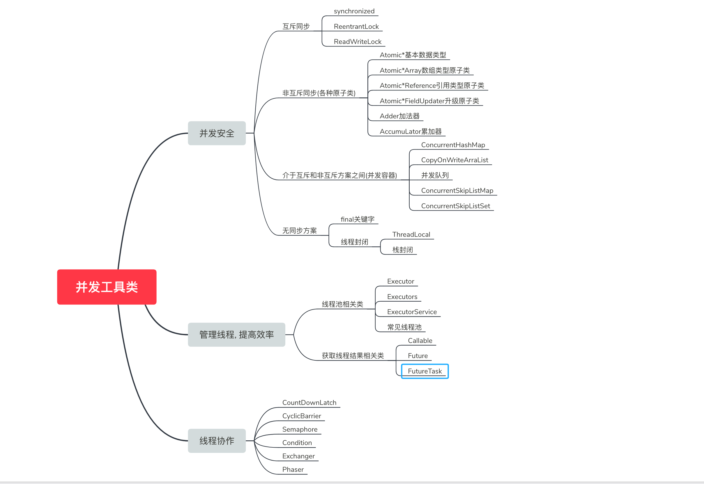

[TOC]

在java中我们将并发工具类可以分为三类:

- 为了并发安全产生的工具类
- 用来管理线程, 提高效率
- 线程协作

### 1.并发安全工具类

#### 1-1.互斥同步

- 使用各种互斥同步锁, synchronized, ReentrantLock, ReadWriteLock...
- 使用同步工具类: Collections.synchronizedList(List<E>), Vector等

#### 1-2.非互斥同步(各种原子类)

- Atomic*基本数据类型: AtomicInteger: 整形原子类, AtomicLong:长整形原子类, AtomicBoolean:布尔型原子类
- Atomic*Array数组类型原子类(数组里的类型可以保证原子性): AtomicIntegerArray: 整形数组原子类, AtomicLongArray: 长整形数组原子类, AtomicReferenceArray: 引用类型数组原子类
- Atomic*Reference引用类型原子类: AtomicReference:基础类, AtomicStampedReference: AtomicReference的升级版本, 带时间戳, 可以解决ABA问题
- Atomic*FieldUpdater升级原子类: AtomicIntegerFieldUpdater: 原子更新整形字段的更新器...
- Adder加法器: LongAdder, DoubbleAdder
- AccumuLator累加器: LongAccumuLator, DubbleAccumuLator

#### 1-3.介于互斥和非互斥方案之间(并发容器)

以下这些容器是结合了CAS && synchronized同时保证了同步

- ConcurrentHashMap
- CopyOnWriteArraList
- 并发队列
- ConcurrentSkipListMap
- ConcurrentSkipListSet

#### 1-4.无同步方案

- final关键字:
- 线程封闭: ThreadLocal, 栈封闭

### 2.用来管理线程, 提高效率

#### 2-1.线程池相关类

- Executor
- Executors
- ExecutorService
- 常见线程池

#### 2-2.获取线程结果相关类

- Callable
- Future
- FutureTask

### 3.线程协作

- CountDownLatch

- CyclicBarrier
- Semaphore
- Condition
- Exchanger
- Phaser

