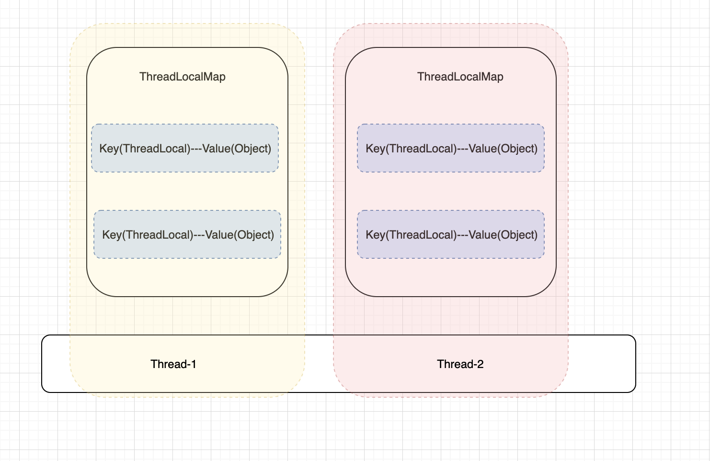

## 1.ThreadLocal的使用场景

- 每一个线程内需要一份独享的对象, 一般来说是工具类, 比如SimpleDateFormat和Random这样非线程安全的工具类
- 线程内需要保存全局信息, 比如用户信息, 避免参数传递的麻烦

### 1-1.线程独享对象

- 测试SimpleDateFormat不是线程安全的, 通过下面的代码我们发现SimpleDateFormat不是线程安全对象

```java
public class PrintDate{

    private static final SimpleDateFormat format = new SimpleDateFormat("yyyy-MM-dd hh:mm:ss");

    private static final ExecutorService executor = Executors.newFixedThreadPool(10);

    public static void main(String[] args) {
        for (int i = 0; i < 1000; i++) {
            int finalI = i;
            executor.submit(() -> {
                Date date = new Date(finalI * 1000);
                String dateFormat = format.format(date);
                System.out.println(dateFormat);
            });
        }
        executor.shutdown();
    }
}

// 执行结果
...
1970-01-01 08:16:35
1970-01-01 08:16:34
1970-01-01 08:16:33
1970-01-01 08:16:32
1970-01-01 08:16:31
1970-01-01 08:16:39  >>>>>> 线程非安全
1970-01-01 08:16:39  >>>>>> 线程非安全
...
```

- 使用加锁的方式使打印时间安全

```java
public class PrintDate{

    private static final SimpleDateFormat format = new SimpleDateFormat("yyyy-MM-dd hh:mm:ss");

    private static final ExecutorService executor = Executors.newFixedThreadPool(10);

    public static void main(String[] args) {
        for (int i = 0; i < 1000; i++) {
            int finalI = i;
            executor.submit(() -> {
                Date date = new Date(finalI * 1000);
              
                // 使用类锁
                synchronized (PrintDate.class) {
                    String dateFormat = format.format(date);
                    System.out.println(dateFormat);
                }
            });
        }
        executor.shutdown();
    }
}
```

- 使用ThreadLocal, 每一个线程一个副本方式解决打印问题

```java
public class ThreadLocalPrint {

    private static final ExecutorService executor = Executors.newFixedThreadPool(10);

    public static void main(String[] args) {
        for (int i = 0; i < 1000; i++) {
            int finalI = i;
            executor.submit(() -> {
                Date date = new Date(finalI * 1000);
                String dateFormat = ThreadLocalFormat.format.get().format(date);
                System.out.println(dateFormat);
            });
        }
        executor.shutdown();
    }

    private static class ThreadLocalFormat {
        private static ThreadLocal<SimpleDateFormat> format = ThreadLocal.withInitial(() -> new SimpleDateFormat("yyyy-MM-dd hh:mm:ss"));
    }
}
```


### 1-2.线程保存全局参数

我们可以使用ThreadLocal保存用户信息, 当需要时直接从ThreadLocal中获取即可

```java
public class RequestContext {

    public static ThreadLocal<String> userName = new ThreadLocal<>();

    public static ThreadLocal<String> userNick = new ThreadLocal<>();
}

public class RequestParam {
    public static void main(String[] args) {
        RequestContext.userName.set("zs");
        RequestContext.userNick.set("li");

        print();
    }

    private static void print() {
        System.out.println(RequestContext.userName.get() + "=====" + RequestContext.userNick.get());
    }
}
```

## 2.ThreadLocal的优点

- 线程安全: 每一个线程一份副本, 没有安全问题
- 不需要加锁, 执行效率高
- 降低复杂度, 比如1-2中的做法

## 3.ThreadLocal实现原理

### 3-1.类之间关系



- 在每一个Thread类中都持有一个ThreadLocalMap成员变量

```java
    /* ThreadLocal values pertaining to this thread. This map is maintained
     * by the ThreadLocal class. */
    ThreadLocal.ThreadLocalMap threadLocals = null;
```

- ThreadLocalMap本质是一个Map(k-v)结构,Key是ThreadLocal, Value是自定义值, 原因是一个Thread中可能有多个ThreadLocal对象

```java
public class RequestContext {

    public static ThreadLocal<String> userName = new ThreadLocal<>();

    public static ThreadLocal<String> userNick = new ThreadLocal<>();
}
```

- ThreadLocalMap是ThreadLocal中的一个内部类

### 3-2.ThreadLocal重要方法

- protected T initialValue(): 返回当前线程的初始值, 这是一个延迟加载的方法, 只有当调用get方法时才会被触发

```java
protected T initialValue() {
  return null;
}

// get方法初始化InitialValue
public T get() {
  Thread t = Thread.currentThread();
  ThreadLocalMap map = getMap(t);
  if (map != null) {
    ThreadLocalMap.Entry e = map.getEntry(this);
    if (e != null) {
      @SuppressWarnings("unchecked")
      T result = (T)e.value;
      return result;
    }
  }
  return setInitialValue();
}

// 初始化InitialValue
private T setInitialValue() {
  T value = initialValue();
  Thread t = Thread.currentThread();
  ThreadLocalMap map = getMap(t);
  if (map != null)
    map.set(this, value);
  else
    createMap(t, value);
  return value;
}
```


- public void set(T value) : 设置一个值

```java
public void set(T value) {
  Thread t = Thread.currentThread();
  ThreadLocalMap map = getMap(t);
  if (map != null)
    map.set(this, value);
  else
    createMap(t, value);
}
```

- public T get(): 获取值

```java
// get方法初始化InitialValue
public T get() {
  Thread t = Thread.currentThread();
  ThreadLocalMap map = getMap(t);
  if (map != null) {
    ThreadLocalMap.Entry e = map.getEntry(this);
    if (e != null) {
      @SuppressWarnings("unchecked")
      T result = (T)e.value;
      return result;
    }
  }
  return setInitialValue();
}
```

- public void remove(): 移除值

```java
public void remove() {
  ThreadLocalMap m = getMap(Thread.currentThread());
  if (m != null)
    m.remove(this);
}
```

### 4.ThreadLocal注意点

#### 4-1.内存泄露问题

- 某个对象不再使用了, 但是这个对象不能被正常回收就有内存泄露问题
- 弱引用: 如果这个对象只被弱引用关联, 那么这个对象时可以被回收的

在ThreadLocalMap中有一个Entry, 这个Entry就是集成了弱引用, 我们分析源码, 发现Entry的key是弱引用, 所以无需被我们释放, 但是value是强引用, 所以value有可能导致内存泄露

```java
static class Entry extends WeakReference<ThreadLocal<?>> {
    /** The value associated with this ThreadLocal. */
    Object value;

    Entry(ThreadLocal<?> k, Object v) {
      super(k); // 弱引用
      value = v;
    }
}
```

##### 4-1-1-1. 什么场景会发生内存泄露

- 正常情况下,线程执行结束,保存在Thread类中的ThreadLocalMap会回收, ThreadLocal里的value自然也会被回收
- 如果线程不会轻易终止,比如线程池,线程会被反复利用, 这时候会发生如下的调用链, 因此value可能内存回收

```java
Thread--->ThreadLocalMap--->Entry(Key:弱引用,可以被回收; Value:强引用,不会被回收---> valueObj)
```

- JDK已经考虑到了内存泄露问题:当set,remove,和rehash时会扫描key为null的entry,并把value值置为null

```java
private void resize() {
    Entry[] oldTab = table;
    int oldLen = oldTab.length;
    int newLen = oldLen * 2;
    Entry[] newTab = new Entry[newLen];
    int count = 0;

    for (int j = 0; j < oldLen; ++j) {
      Entry e = oldTab[j];
      if (e != null) {
        ThreadLocal<?> k = e.get();
        if (k == null) {
          e.value = null; // Help the GC  ********************
        } else {
          int h = k.threadLocalHashCode & (newLen - 1);
          while (newTab[h] != null)
            h = nextIndex(h, newLen);
          newTab[h] = e;
          count++;
        }
      }
    }

    setThreshold(newLen);
    size = count;
    table = newTab;
}

```

- 在日常使用ThreadLocal时必须在使用完释放,调用remove,防止内存泄露