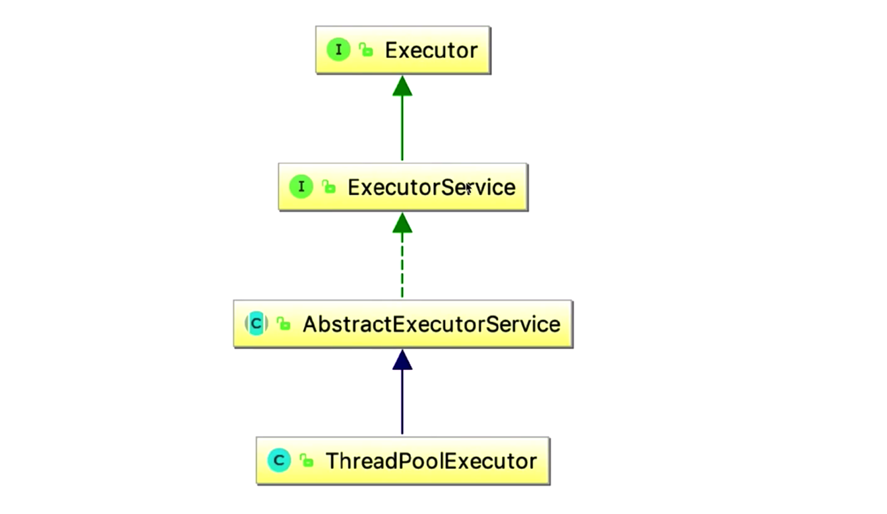

[TOC]

## 1.创建线程池

线程池用来合理管理我们的线程资源, 就好比水池来储存水资源一样.线程池的出现解决以下问题:

- 线程不能重复利用, 反复创建线程开销大
- 过多的线程会占用太多内存

### 1-1.创建和停止线程池

线程池构造函数参数:

| 参数            | 类型                     | 解析                                                         |
| --------------- | ------------------------ | ------------------------------------------------------------ |
| corePoolSize    | int                      | 核心线程数: 线程池完成初始化之后,默认情况下线程池中没有任何线程, 线程池会等待有任务来时创建新的线程执行 |
| maximumPoolSize | int                      | 最大线程数: 当提交的任务大于核心线程数时, 并且阻塞队列已经满了, 线程池就会在核心线程数基础上再增加一些线程去执行, 但是这个增加是有上限的, 上限就是maximumPoolSize |
| keepAliveTime   | long                     | 保持存活时间: 如果线程数大于corePoolSize,并且多余的线程存活时间大于keepAliveTime,  那么它们将被终止 |
| unit            | TimeUnit                 | 时间单位                                                     |
| workQueue       | BlockingQueue            | 阻塞队列(有3种常见的队列类型):                                  1. 直接交接: SynchronousQueue, 不能存储任务, 相当于没有队列                                                                         2. 无界队列: LinkedBlockingQueue,队列不会被放满, 设置maximumPoolSize无效, 如果速度增长太快可能导致oom                                                                             3. 有界队列:ArrayBlockingQueue,maximumPoolSize有意义 |
| threadFactory   | ThreadFactory            | 当线程池需要新的线程时, 会使用threadFactory创建线程:                                                                                  1. 默认使用Executors.defaultThreadFactory()                    2. 创建出来的线程都在同一个线程组,拥有同样的优先级, 并且都不是守护线程, 如果自己指定线程工厂,可以指定线程名称, 线程组, 优先级, 是否守护线程等 |
| handler         | RejectedExecutionHandler | 拒绝策略                                                     |

- 如果线程数小于corePoolSize, 即使其他线程处于空闲状态, 此时提交一个任务也会创建新的线程去执行
- 如果线程数等于或者大于corePoolSize, 此时提交任务会放到阻塞队列中
- 如果队列已满并且线程数小于maximumPoolSize, 则创建一个新的任务来执行
- 如果队列已满并且线程数到达maximumPoolSize,此时走拒绝策略

### 1-2.设置不同参数

- corePoolSize和maximumPoolSize相同时就可以创建固定大小线程的线程池
- 设置maximumPoolSize=Integer.MAX_VALUE, 就可以允许线程池容纳任意数量的并发任务
- workQueue为无界队列: 只有当阻塞队列满时才会创建新的线程, 如果队列是无界队列, 那么线程就不会超过corePoolSize

### 1-3.线程池手动创建还是自动创建

手动创建比较好, 因为这样可以让我们更明确线程池的运行规则, 避免资源耗尽的风险, 常见自动创建线程池方式:

- Executors.newFixedThreadPool(int nThreads): 固定线程数量的线程池

```java
// workQueue = LinkedBlockingQueue, 无界队列, 当请求增加比较快的时候 && 无法及时处理完, 就会请求堆积,      占用大量内存, 导致OOM
public static ExecutorService newFixedThreadPool(int nThreads) {
  return new ThreadPoolExecutor(nThreads, nThreads,
                                0L, TimeUnit.MILLISECONDS,
                                new LinkedBlockingQueue<Runnable>());  
}
```

- Executors.newSingleThreadExecutor(): 线程池中始终维护一个线程

```java
// workQueue = LinkedBlockingQueue, 无界队列,当请求增加比较快的时候 && 无法及时处理完, 就会请求堆积,      占用大量内存, 导致OOM
public static ExecutorService newSingleThreadExecutor() {
  return new FinalizableDelegatedExecutorService
    (new ThreadPoolExecutor(1, 1,
                            0L, TimeUnit.MILLISECONDS,
                            new LinkedBlockingQueue<Runnable>()));
}
```

- Executors.newCachedThreadPool():无界线程池, 具有自动回收多余线程的功能

```java
// workQueue = SynchronousQueue, 使用交换队列,不存储任务; maximumPoolSize = Integer.MAX_VALUE,相当于无限队列, 并且keepAliveTime = 60s, 相当于60s没被使用的线程将会被回收; 当线程数量比较多的时候也会OOM
public static ExecutorService newCachedThreadPool() {
  return new ThreadPoolExecutor(0, Integer.MAX_VALUE,
                                60L, TimeUnit.SECONDS,
                                new SynchronousQueue<Runnable>());
}
```

- Executors.newScheduledThreadPool(int corePoolSize): 可以做一些定时执行任务

```java
public ScheduledThreadPoolExecutor(int corePoolSize) {
     super(corePoolSize, Integer.MAX_VALUE, 0, NANOSECONDS, new DelayedWorkQueue());
}
```

### 1-4.线程池中的线程数量

- CPU密集型任务(加密, Hash等): 最佳线程数为cpu核心的1-2倍
- IO密集型(读写数据库, 网络, 文件): 一般大于CPU核心很多倍, 比如10倍等,  具体以实际JVM监控繁忙程度为准
- 综合上述: 线程数 = CPU核心数 * (1 + 平均等待时间 / 平均工作时间)
- 最准确的应该在实际环境压测, 得到一个合理的线程数量

## 2.关闭线程池

调用shutdown()方法

- 使线程池不接收新任务,等待存量任务执行完毕后关闭线程池
- 当调用shutdown之后有新的任务提交, 就会拒绝

判断线程池是否进入shutdown状态: 

```java
public boolean isShutdown() {
  return ! isRunning(ctl.get());
}
```

判断线程是否已经完全停止:

```java
public boolean isTerminated() {
  return runStateAtLeast(ctl.get(), TERMINATED);
}
```

一段时间后是否完全停止, 此方法会阻塞:

```java
 public boolean awaitTermination(long timeout, TimeUnit unit)
```

立马停止线程:正在运行的线程会收到interrupt异常信号, 还没有执行的任务会被返回一个List<Runnable>

```java
public List<Runnable> shutdownNow()
```

## 3.线程池拒绝策略

### 3-1.拒绝时机

- 当Executor关闭时, 新提交的任务就会拒绝
- 阻塞队列已满 && 线程数也到达maximumPoolSize也会走拒绝策略

### 3-2.拒绝策略

- AbortPolicy: 直接抛出异常
- DiscardPolicy: 丢弃任务, 也不会通知你
- DiscardOldestPolicy: 丢弃阻塞队列中最老的队列
- CallerRunsPolicy: 让提交线程(父线程)去处理

### 3-3.钩子方法

在每一个任务执行之前或者之后做一系列的事情

```java
public class LogThreadPool extends ThreadPoolExecutor {
    public LogThreadPool(int corePoolSize, int maximumPoolSize, long keepAliveTime, TimeUnit unit, BlockingQueue<Runnable> workQueue) {
        super(corePoolSize, maximumPoolSize, keepAliveTime, unit, workQueue);
    }

    @Override
    protected void beforeExecute(Thread t, Runnable r) {
        System.out.println("钩子函数开始");
    }

    @Override
    protected void afterExecute(Runnable r, Throwable t) {
        System.out.println("钩子函数结束");
    }

    public static void main(String[] args) {
        for (int i = 0; i < 3; i++) {
            new LogThreadPool(1, 1, 0, TimeUnit.SECONDS, new LinkedBlockingQueue<>()).submit(() -> {

            });
        }
    }
}

// 运行结果
钩子函数开始
钩子函数开始
钩子函数开始
钩子函数结束
钩子函数结束
钩子函数结束
```

## 4.实现原理

- 线程池管理器
- 工作线程
- 任务队列
- 任务接口(Task)

### 4-1.Executor家族



- Executor是一个顶层接口, 只有一个方法

```java
public interface Executor {
    void execute(Runnable command);
}
```

- ExecutorService:继承了Executor接口, 又增加了几个新的方法

```java
public interface ExecutorService extends Executor {

    void shutdown();

    List<Runnable> shutdownNow();

    boolean isShutdown();

    boolean isTerminated();

    boolean awaitTermination(long timeout, TimeUnit unit) throws InterruptedException;

    <T> Future<T> submit(Callable<T> task);
  
    <T> Future<T> submit(Runnable task, T result);

    Future<?> submit(Runnable task);
}
```

- Executors:实际上是一个工具类, 用来帮助我们自动创建线程池等, 本质还是使用了ThreadPoolExecutor构造器

```java
public class Executors {
	  public static ExecutorService newFixedThreadPool(int nThreads) {
        return new ThreadPoolExecutor(nThreads, nThreads,
                                      0L, TimeUnit.MILLISECONDS,
                                      new LinkedBlockingQueue<Runnable>());
    }
  
    public static ExecutorService newCachedThreadPool() {
        return new ThreadPoolExecutor(0, Integer.MAX_VALUE,
                                      60L, TimeUnit.SECONDS,
                                      new SynchronousQueue<Runnable>());
    }
  
   ...
}
```

- ThreadPoolExecutor: 实际的线程池, 我们构建线程池时都使用该构造方法

## 5.线程池的状态

- Runing: 接收新的任务并处理排队任务
- Shutdown:不接收新任务, 但是会执行已经排队的任务
- Stop: 不接收新任务, 也不执行排队的任务, 并且会将正在执行任务中断
- Tidying:中文是整洁的意思,所有的任务都已经终止, workCount=0,线程会转换到Tidying, 随后会调用钩子函数terminated()方法进入terminated状态
- terminated: terminated()运行完成

在ThreadPoolExecutor类中,查看线程池状态源码:

```java
    // runState is stored in the high-order bits
    private static final int RUNNING    = -1 << COUNT_BITS;
    private static final int SHUTDOWN   =  0 << COUNT_BITS;
    private static final int STOP       =  1 << COUNT_BITS;
    private static final int TIDYING    =  2 << COUNT_BITS;
    private static final int TERMINATED =  3 << COUNT_BITS;
```

## 6.ThreadPoolExecutor源码分析

```java
    public void execute(Runnable command) {
        if (command == null)
            throw new NullPointerException(); // 1.如果提交的任务为null, 则抛出异常
        int c = ctl.get();
        if (workerCountOf(c) < corePoolSize) {
            // 2.如果当前线程小于核心线程数, 则添加新的线程,调用addWorker()去执行
            if (addWorker(command, true))  
                return;
            c = ctl.get();
        }
      
        // 3. 如果当前线程不小于核心线程数, 则放入阻塞队列中
        if (isRunning(c) && workQueue.offer(command)) {
            int recheck = ctl.get();
            // 4.如果当前线程池不是runing, 并且线程已经被remove,则执行拒绝策略
            if (! isRunning(recheck) && remove(command))
                reject(command);
            else if (workerCountOf(recheck) == 0)
                addWorker(null, false);
        }
      
        // 5.如果放入阻塞队列已满, 则尝试创建线程到达maximumPoolSize, 如果增加失败, 则走拒绝策略
        else if (!addWorker(command, false))
            reject(command);
    }
```