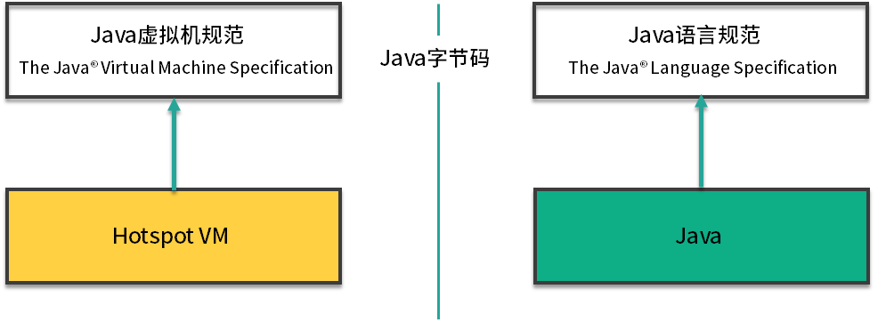

## 1.jvm和操作系统的关系

Jvm全称Java Virtual Machine, 也就是java虚拟机. 能识别.class为后缀的文件,并且能够解析class文件指令,最终调用操作系统上面的函数,完成想要的操作

- 一般c++语言的编写的程序, 编译成二进制文件后就能立马执行, 因为操作系统可以直接识别
- java语言使用javac将源代码编译成.class文件之后,操作系统不能够识别并且执行, 需要借助jvm(java虚拟机)才能够执行
- java是一门抽象比较高的语言, 提供了自动内存管理一系列特性, 这些特性直接在操作系统上实现不太可能, 所以就需要jvm帮助实现; 另外jvm也实现了跨平台

### 1-1.jvm与操作系统总结

jvm上承java语言,下接操作系统, 他的中间接口就是字节码

## 2.jvm, jre, jdk的关系

### 2-1.JRE

如果java只有jvm那什么也做不了, 它的运行还需要一个基本的类库, 比如如何读取文件,连接网络等等. 而java也会把这些类库一次性给它. 所以JVM + 实现的一堆基础类库就组成了java运行时环境. 也就是我们常说的jre(Java Runtime Enviroment)

### 2-2.JDK

有了jre,java程序便可以运行了. 但是对于jdk,除了jre之外还有一些好用的工具类, 比如javac, java, jar等, 所以jdk就是java运行环境 + 一堆的工具类, 由名字也可以看得出: java development kit

## 3.java虚拟机规范和java语言规范

- 广义来讲jvm是一种规范, 他是最为官方, 最为精确的文档
- 狭义来讲: 由于我们使用Hotspot比较多, 我们会成为Hotspot
- Java 虚拟机规范: 其实就是为输入和执行字节码提供一个运行环境
- Java 语法规范: 比如 switch、for、泛型、lambda 等相关的程序，最终都会编译成字节码
- 连接java虚拟机规范和java语言规范的桥梁依然是字节码

## 4.字节码的执行

