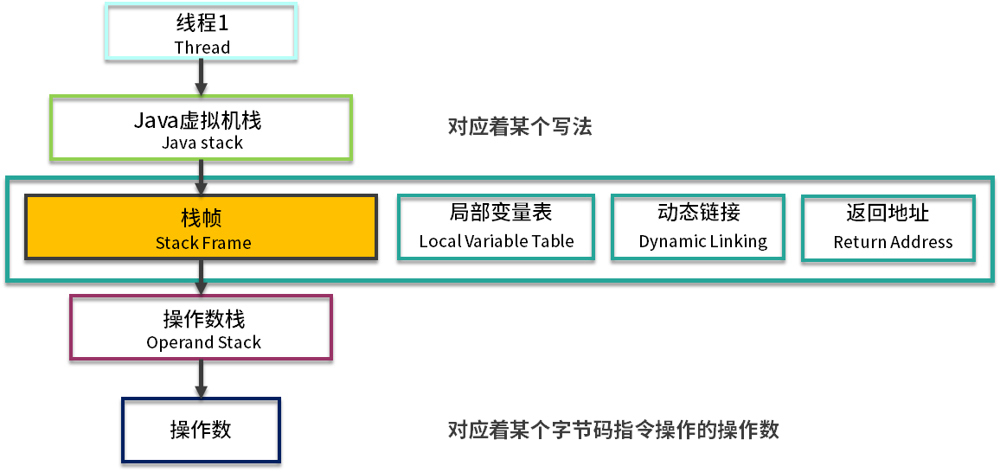

[TOC]

## 1.jvm内存结构

java语言和c, c++这些语言不同, 它有自动内存管理等高级特性, 相比C,C++的手动内存管理,难以理解的指针等,Java写起来就方便多了

> 1. java虚拟机在执行java程序的时候会把它管理的内存划分为多个不同的数据区域, 这些区域各有用途,以及创建和销毁的时间, 有的同jvm进程生命周期, 有的同用户线程建立和消亡, 根据<<java虚拟机规范>>的固定,运行时区域划分如下
> 2. 随着java的发展,jvm内存结构划分一直都有调整, 比如java8之后的版本移除了永久代,而使用 Metaspace 来进行替代.-XX:PermSize 和 -XX:MaxPermSize 等参数调优，已经没有了意义.

### 1-1.栈(java虚拟机栈 + 本地方法栈)

> 首先栈的数据结构是先进后出, 就跟我们机关枪的弹夹一样, 先上膛的子弹后发射. 我们在上面提到，Java 虚拟机栈是基于线程的, 哪怕你只有一个 main() 方法，也是以线程的方式运行的。在线程的生命周期中，参与计算的数据会频繁地入栈和出栈，栈的生命周期是和线程一样的。

栈里的每条数据，就是栈帧。在每个 Java 方法被调用的时候，都会创建一个栈帧，并入栈。一旦完成相应的调用，则出栈。所有的栈帧都出栈后，线程也就结束了。每个栈帧，都包含四个区域：

- 局部变量表
- 操作数栈
- 动态连接
- 返回地址

> 1. 这里有一个两层的栈。第一层是栈帧，对应着方法；第二层是方法的执行，对应着操作数
> 2. 所有的字节码指令，其实都会抽象成对栈的入栈出栈操作。执行引擎只需要按顺序执

### 1-2.程序计数器(线程私有)

既然是线程，就代表它在获取 CPU 时间片上，是不可预知的，需要有一个地方，对线程正在运行的点位进行缓冲记录，以便在获取 CPU 时间片时能够快速恢复, 这就是程序计数器的工作

> 程序计数器是一块较小的内存空间，它的作用可以看作是当前线程所执行的字节码的行号指示器。这里面存的，就是当前线程执行的进度

- 程序计数器是因为线程而产生的，与虚拟机栈配合完成计算操作

- 程序计数器存储当前正在运行的流程，包括正在执行的指令、跳转、分支、循环、异常处理等
- 下面这张图是使用javac编译后的字节码, 然后使用javap -verbose DeCompile.class输出内容, 我们可以看到每一个opcode前面都有一个序号, 可以认为他就是程序计数器需要记的内容

### 1-3.堆

> 1. 堆是 JVM 上最大的内存区域，我们申请的几乎所有的对象，都是在这里存储的。我们常说的垃圾回收，操作的对象就是堆。
> 2. 堆空间一般是程序启动时，就申请了，但是并不一定会全部使用。
> 3. 随着对象的频繁创建，堆空间占用的越来越多，就需要不定期的对不再使用的对象进行回收。这个在 Java 中，就叫作 GC（Garbage Collection）。

一个对象创建的时候，到底是在堆上分配，还是在栈上分配呢？这和两个方面有关：对象的类型和在 Java 类中存在的位置。

- 对于普通对象来说，JVM 会首先在堆上创建对象，然后在其他地方使用的其实是它的引用。比如，把这个引用保存在虚拟机栈的局部变量表中。
- 对于基本数据类型来说（byte、short、int、long、float、double、char)，有两种情况: 每个线程拥有一个虚拟机栈, 当你在方法体内声明了基本数据类型的对象，它就会在栈上直接分配。其他情况，都是在堆上分配。
- 注意，像 int[] 数组这样的内容，是在堆上分配的。数组并不是基本数据类型。

### 1-4.元空间

#### 1-4-1.为什么有 Metaspace 区域

我们日常将java源代码编译成字节码之后才能被jvm解析执行, 那么有没有想过这些字节码存储在哪里呢? 想要问答这个问题，就不得不提下 Java 的历史. 

- 在 Java 8 之前，这些类的信息是放在一个叫 Perm 区的内存里面的。
- 更早版本，甚至 String.intern 相关的运行时常量池也放在这里。这个区域有大小限制，很容易造成 JVM 内存溢出，从而造成 JVM 崩溃。

Perm 区在 Java 8 中已经被彻底废除，取而代之的是 Metaspace。原来的 Perm 区是在堆上的，现在的元空间是在非堆上的

#### 1-4-2. Metaspace有什么缺点

- 使用非堆可以使用操作系统的内存，JVM 不会再出现方法区的内存溢出；但是，无限制的使用会造成操作系统的死亡。所以，一般也会使用参数 -XX:MaxMetaspaceSize 来控制大小。
- 方法区，作为一个概念，依然存在。它的物理存储的容器，就是 Metaspace。这个区域存储的内容，包括：类的信息、常量池、方法数据、方法代码就可以了。

#### 1-4-3. 我们常说的字符串常量，存放在哪呢？

- 字符串常量池，已经移动到堆上（jdk8之前是perm区），也就是执行intern方法后存的地方
- 类文件常量池，constant_pool，是每个类每个接口所拥有的，这部分数据在方法区，也就是元数据区。而运行时常量池是在类加载后的一个内存区域，它们都在元空间。