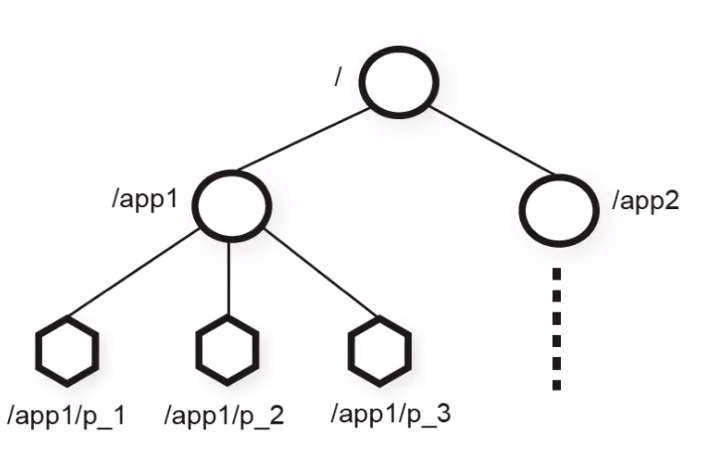
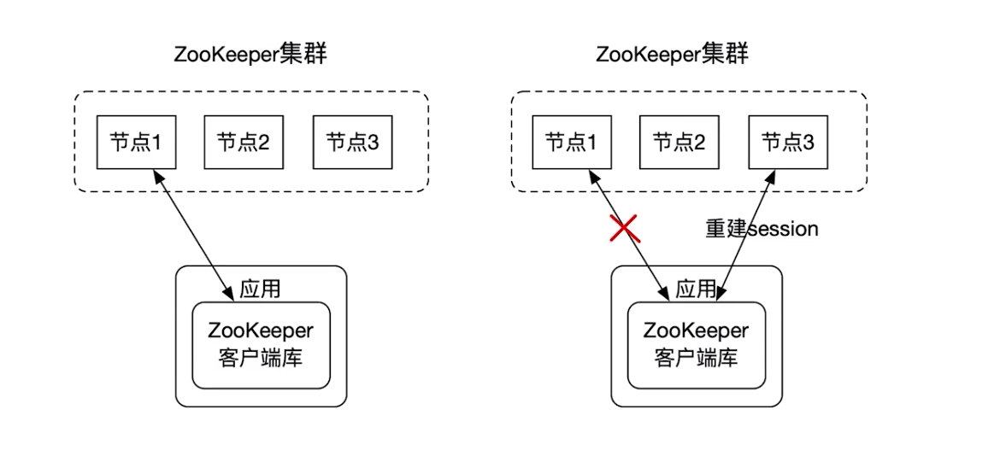

[TOC]

## 1.zookeeper简介

### 1-1.基本概念

zookeeper是一个开源的,高可用的分布式协同服务系统, 可以作为配置中心, 命名空间管理, 分布式锁, 服务注册于发现等


### 1-2.应用案例

- Hadoop:使用zk做NameNode的高可用
- Hbash:使用zk做master选举
- kafka:集群成员管理,conroller节点选举


### 1-3.应用场景

- 配置管理(configuration management)
- DNS服务
- 组成员管理
- 分布式锁

## 2.zookeeper的模型

### 2-1.zookeeper的数据模型

zookeeper的数据模型是层次模型,也就是我们常见的文件系统模型, zookeeper的层次模型称作为data tree, 每个数据节点称作znode, 不同于文件系统的是每一个znode都有一个版本version,版本从0开始



### 2-2.zookeeper的znode分类

- 持久性znode(PERSISTENT): 这样的节点即使发生zk宕机, 或者client宕机也不会丢失
- 临时性znode(EPHERRAL): client宕机或者在指定timeout时间内, client没有给server发送心跳
- 顺序性znode: 每一个顺序的znode关联一个单调递增的整数,这个单调递增的整数是znode名字的后缀
- 持久顺序性znode(PERSISTENT_SEQUENTIAL)
- 临时顺序性znode(EPHERRAL_SEQUENTIAL)


## 3.zookeeper的环境安装

### 3-1.zk下载安装

- zookeeper的唯一依赖是jdk7+版本,所以首先需要安装jdk7以上版本
- zookeeper官网: <https://zookeeper.apache.org/> , 稳定版本地址: <https://archive.apache.org/dist/zookeeper/stable/>
- 下载解压: wget https://archive.apache.org/dist/zookeeper/stable/apache-zookeeper-3.5.6-bin.tar.gz


### 3-2.zk-server的配置

- 配置zk的环境变量

```bash
# vim /etc/profile
export ZK_HOME=/usr/local/apache-zookeeper-3.5.6-bin
export PATH=$PATH:$ZK_HOME/bin

# source /etc/profile
```

- 配置zk的配置文件

```bash
1.复制一个zoo.cfg的配置文件
# cd /usr/local/apache-zookeeper-3.5.6-bin/conf
# cp zoo_sample.cfg zoo.cfg
# vim zoo.cfg

(1.)clientPort=2181 : 客户端连接的端口
(2.)dataDir=/tmp/zookeeper: zk的快照和日志文件, 建议改成别的目录: /home/appsvr/data/zookeeper

```

### 3-3.zk启动和连接

- 启动zookeeper服务

```bash
# zkServer.sh start
ZooKeeper JMX enabled by default
Using config: /usr/local/apache-zookeeper-3.5.6-bin/bin/../conf/zoo.cfg
Starting zookeeper ... STARTED

2. 进入到日志目录查看有没有异常
# cd /usr/local/apache-zookeeper-3.5.6-bin/logs
# grep -E -i "((exception)|(error))" *

3.进入到数据目录查看交易和快照文件
# cd /home/appsvr/data/zookeeper
# tree
.
├── version-2
│   └── snapshot.0
└── zookeeper_server.pid

1 directory, 2 files

4. 查看端口情况
netstat -anpl | grep 2181
tcp        0      0 0.0.0.0:2181            0.0.0.0:*               LISTEN      24192/java
```

- zkCli连接zkServer

```bash
# zkCli.sh

1.递归显示所有znode
# ls -R /
/
/zookeeper
/zookeeper/config
/zookeeper/quota
```

### 3-4. 使用zkCli实现简单的分布式锁

- 打开连个zkCli客户端连接A, B
- A客户端创建临时节点

```bash
# create -e /lock
Created /lock
```

- B客户端再次创建临时节点失败

```bash
# create -e /lock
Node already exists: /lock
```

- B客户端water锁

```bash
# stat -w /lock
```

- A客户端断开连接B客户端触发监听事件

```bash
WATCHER::

WatchedEvent state:SyncConnected type:NodeDeleted path:/lock
```

- B客户端再次尝试加锁

```bash
# create -e /lock
Created /lock
```


## 4.zookeeper实现master-work模式

Master-worker是分布式中广泛使用的一个分布式架构, master-worker中有一个master负责worker状态的监控,并为worker分配任务

- 在任何时候系统中最多只能有一个master, 不可能出现两个master的情况, 如果active-master失败了, 则backup-master可以很快的替换上来
- master可以实时监控worker的状态,能够及时收集到worker成员状态变化的通知,master在收到worker状态的变更时, 通常进行任务的重新分配


## 5.zookeeper的整体架构

### 5-1.两种集群模式

zookeeper的集群架构可以分为两种模式: standalone和quorum模式

- standalone:集群中只有一个节点,存在单点问题
- quorum: 包含多个节点的zk集群


### 5-2.session

当zk的客户端和服务端连接的时候就会创建一个session, 客户端可以主动关闭session, 另外如果zk服务端在timeout时间内没有收到客户端心跳也会关闭session, 当客户端发现session异常时可以重新发起与其他服务节点的连接



### 5-3.集群Quorum模式

处于Quorum模式的zk集群包含多个zk节点, 其中有leader节点和follower节点;

-  leader节点可以处理读请求和写请求
-  follower只可以处理写请求, follower在接收到写请求时会把写请求转发给leader来处理

### 5-4.zookeeper的数据一致性

- 全局的可线性化写入: 先到达leader的写请求先被执行, leader决定写请求的执行顺序
- 保证客户端的FIFO: 来自给客户端的请求按照发送顺序执行