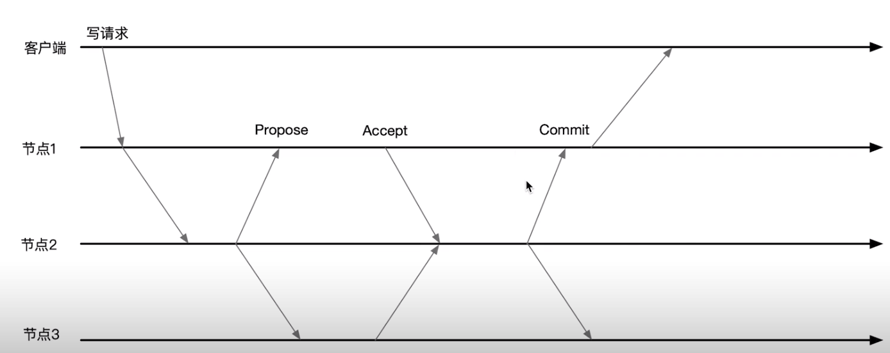

[TOC]

## 1.zk的生产配置

### 1-1.zk配置项

zookeeper的配置项在zoo.cfg这个配置文件中, 另外有些配置项可以通过java系统来进行设置, zoo.cfg的主要配置项有:

- clientPort: zookeeper对客户端提供服务的端口
- dataDir: 用来保存快照文件的目录, 如果没有dataLogDir, 事务日志文件也会保存在这个目录
- dataLogDir: 用来保存事务日志文件的目录, zk在提交一个事务之前必须保证事务日志落盘, 所以一般会给事务日志文件单独开一块磁盘


### 1-2.zk的硬件要求

- 内存: zookeeper需要在内存中存放data tree, 对于一般的zookeeper使用场景8G的内存足够
- zookeeper对cpu的要求不高, 只要保证zookeeper有一个独占的核心即可, 一般2核心的机器就可以了
- 因为存储设备的写入延迟会直接影响事务提交效率, 建议为dataLogDir分配一个独占的SSD


## 2.搭建一个三个节点的zk

- 三台机器中分别安装JDK && 下载zk的包

```bash
export JAVA_HOME=/usr/local/jdk1.8.0_231
export JRE_HOME=${JAVA_HOME}/jre
export CLASSPATH=.:${JAVA_HOME}/lib:${JRE_HOME}/lib
export PATH=${JAVA_HOME}/bin:$PATH

export ZK_HOME=/usr/local/apache-zookeeper-3.5.6-bin
export PATH=${ZK_HOME}/bin:$PATH
```


- 在每一台机器的zoo.cfg中配置集群信息: 

```bash
1.每一台机器配置
server.1=IP1:2888:3888
server.2=IP2:2888:3888
server.3=IP3:2888:3888

(1.)IP1,IP2,IP3:表示三台机器的IP地址
(2.)2888: zk集群间通信的端口, 3888:选举的端口
(3.)在dataDir所对应的目录下建立myid文件,内容分别是1 | 2 | 3 代表集群的id标号, 也就是这里的server.1, server.2, server.3
(4.)特别提示如果端口不通请查看防火墙
```

- 启动zk

```bash
# zkServer.sh start
```

- 查看节点状态

```bash
# zkServer.sh status
ZooKeeper JMX enabled by default
Using config: /usr/local/apache-zookeeper-3.5.6-bin/bin/../conf/zoo.cfg
Client port found: 2181. Client address: localhost.
Mode: follower


# zkServer.sh status
ZooKeeper JMX enabled by default
Using config: /usr/local/apache-zookeeper-3.5.6-bin/bin/../conf/zoo.cfg
Client port found: 2181. Client address: localhost.
Mode: leader

...
```


- 按照我本地的安装方式, 使用zkCli连接服务端

```bash
# zkCli.sh -server 192.168.1.30:2181,192.168.1.31:2181,192.168.1.32:2181
```


## 3.zk的监控

- 打开jmx的端口

```bash
# export JMXPORT=8081
```

- 启动zk

```bash
# zkServer.sh status
```

- 在本地打开jconsole连接

```bash
# jconsole
```


## 4.zk的事务提交模式



- 客户端连接到node1上面, 并且发送写请求
- 因为node1不是master所以将写请求同步给master node2
- node2向所有节点发起事务提案Propose
- 当有大于一半的机器返回Accept时则, master发送commit
- 当连接客户端的node1收到commit时返回客户端成功


### 4-1.Observer

observer不参与事务的提交和参与选举的过程, 所以在处理事务时不消耗性能, 我们可以增加Observer来增加集群的读能力, 如何配置Observer节点

```bash
1.我们将第四个节点配置成observer
server.1=IP1:2888:3888
server.2=IP2:2888:3888
server.3=IP3:2888:3888
server.4=IP3:2888:3888:observer
```


### 4-2.zxid事务提交id

对每一个zookeeper data tree都会作为一个事务执行, 每一个事务都有一个zxid, zxid是一个64位的整数, zxid由两部分组成, 高四个字节是epoch, 低四个字节保存的是counter

```bash
1.查看事务信息, 在数据的存储目录/data/zookeeper/version-2
# zkTxnLogToolkit.sh log.400000001
19-12-25 下午11时47分43秒 session 0x300000c49c70000 cxid 0x0 zxid 0x400000001 createSession 30000
19-12-25 下午11时48分03秒 session 0x300000c49c70000 cxid 0x6 zxid 0x400000002 create /work,1,[31,s{'world,'anyone}
],true,2
19-12-25 下午11时50分33秒 session 0x300000c49c70000 cxid 0x7 zxid 0x400000003 setData /work,2,1
```


